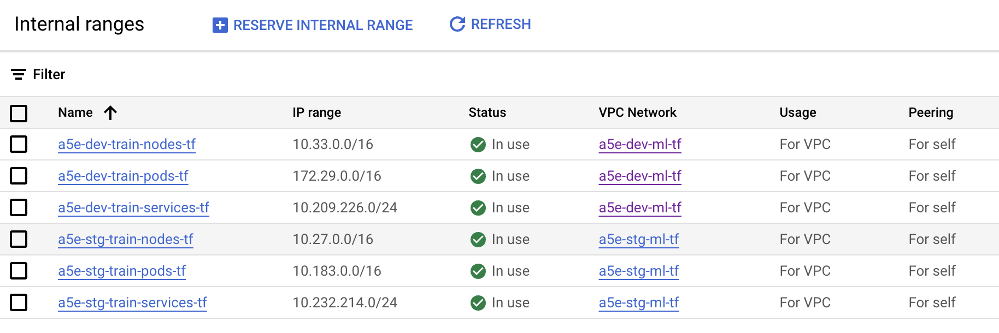

# Resource Nomenclature

Terraform managed resources adhere to the following nomenclature.  

- They are prefixed with a `a5e`, a compacted `abridge` prefix to minimize
  resource name length.  This provides a kind of namespace protection against
  other resources and implicitly groups ABridge resources when displayed in
  lexical order.
- They are suffixed with a `_tf` to indicate that they are managed by Terraform.
- Environment name SHOULD follow the `a5e` prefix.  This will implicitly group
  resources from the same environment.

---

An example of the implicit grouping that occurs.

